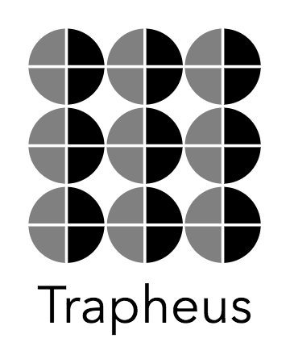
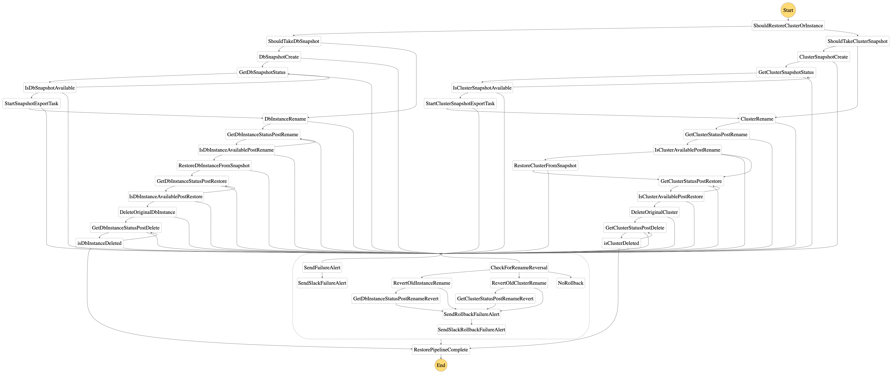
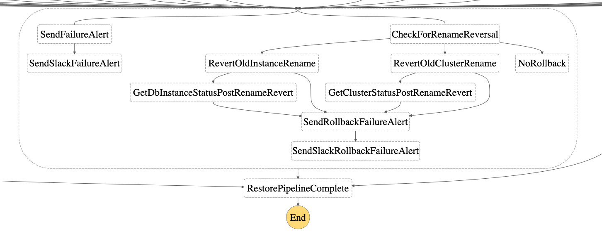

# Trapheus



- [AWS RDS Snasphot Restoration](#Trapheus)
- [Pre-Requisites](#pre-requisites)
- [Parameters](#parameters)
- [Instructions](#instructions)
- [How it Works](#how-it-works)
  - [AWS Step Functions State Machine](#aws-step-functions-state-machine)


With Trapheus, it becomes easy to get and restore database instances from snapshots into any dev, staging or production environments. Trapheus supports individual RDS Snapshot as well as cluster snapshot restore operations. 
Trapheus is modelled as a state machine with the help of AWS step functions that executes different steps in order to restore the an existing database from a snapshot. 
Trapheus can be scheduled using a cloudwatch alarm rule or can be run using any of the supported AWS step function triggers.

**Important:** this application uses various AWS services and there are costs associated with these services after the Free Tier usage - please see the [AWS  pricing page](https://aws.amazon.com/pricing/) for details.


```bash

├── CONTRIBUTING.md                               <-- How to contribute to Trapheus
├── LICENSE.md                                    <-- The MIT license.
├── README.md                                     <-- The Readme file.
├── events
│   └── event.json                                <-- JSON event file to be used for local SAM testing
├── screenshots                                   <-- Folder for screenshots of teh state machine.
│   ├── Trapheus-logo.png
│   ├── cluster_restore.png
│   ├── cluster_snapshot_branch.png
│   ├── failure_handling.png
│   ├── instance_restore.png
│   ├── instance_snapshot_branch.png
│   ├── isCluster_branching.png
│   └── restore_state_machine.png
├── src
│   ├── checkstatus
│   │   ├── DBClusterStatusWaiter.py              <-- Python Waiter for checking the status of the cluster
│   │   ├── get_dbcluster_status_function.py      <-- Python Lambda code for polling the status of a clusterised database
│   │   ├── get_dbstatus_function.py              <-- Python Lambda code for polling the status of a non clusterised RDS instance
│   │   └── waiter_acceptor_config.py             <-- Config module for the waiters
│   ├── common                                    <-- Common modules across the state machine deployed as a AWS Lambda layer.
│   │   ├── common.zip
│   │   └── python
│   │       ├── constants.py                      <-- Common constants used across the state machine.
│   │       ├── custom_exceptions.py              <-- Custom exceptions defined for the entire state machine.
│   │       └── utility.py                        <-- Utility module.
│   ├── delete
│   │   ├── cluster_delete_function.py           <-- Python Lambda code for deleting a clusterised database.
│   │   └── delete_function.py                   <-- Python Lambda code for deleting a non clusterised RDS instance.
│   ├── emailalert
│   │   └── email_function.py                    <-- Python Lambda code for sending out failure emails.
│   ├── rename
│   │   ├── cluster_rename_function.py           <-- Python Lambda code for renaming a clusterised database.
│   │   └── rename_function.py                   <-- Python Lambda code for renaming a non-clusterised RDS instance.
│   ├── restore
│   │   ├── cluster_restore_function.py          <-- Python Lambda code for retoring a clusterised database.
│   │   └── restore_function.py                  <-- Python Lambda code for restoring a non-clusterised RDS instance
│   └── snapshot
│       ├── cluster_snapshot_function.py         <-- Python Lambda code for creating a snapshot of a clusterised database.
│       └── snapshot_function.py                 <-- Python Lambda code for creating a snapshot of a non-clusterised RDS instance.
├── template.yaml                                <-- SAM template definition for the entire state machine.
└── tests                                        <-- Test folder.
    └── unit
        ├── mock_constants.py
        ├── mock_custom_exceptions.py
        ├── mock_import.py
        ├── mock_utility.py
        ├── test_cluster_delete_function.py
        ├── test_cluster_rename_function.py
        ├── test_cluster_restore_function.py
        ├── test_cluster_snapshot_function.py
        ├── test_delete_function.py
        ├── test_email_function.py
        ├── test_get_dbcluster_status_function.py
        ├── test_get_dbstatus_function.py
        ├── test_rename_function.py
        ├── test_restore_function.py
        └── test_snapshot_function.py

```

## Pre-Requisites

The app requires the following AWS resources to exist before installation:

1. One [SES configured email account in AWS](https://docs.aws.amazon.com/ses/latest/DeveloperGuide/send-email-set-up.html) for sending out failure alerts.

2. `python3.7` installed on local machine following [this](https://www.python.org/downloads/). 

3. Have `sam` installed in the local machine. Can be installed following the [Installing the AWS SAM CLI](https://docs.aws.amazon.com/es_es/serverless-application-model/latest/developerguide/serverless-sam-cli-install.html) documentation.

4. One or more instances of a RDS database that you wish to restore.


## Parameters

The following are the parameters for creating the cloudformation template:

1. `vpcID` : [Required] The VPC id (region specific) under which the various lambdas will be configured. The RDS instances, for which the state machine will be used, should be in the same VPC as well. 
2. `Subnets` : [Required] A comma separated list of private subnet ids (region specific) in the chosen VPC, used to configure the VPC config for all the lambdas
3. `SenderEmail` : [Required] A SES email alert is configured to notify the user about any failures in the state machine. The sender email parameter is needed to configure the email id through which the alert is sent out. Please ensure the same is configured in SES
4. `RecipientEmail` : [Required] Comma separated list of recipient email addresses that should receive the failure email alerts

## Instructions

**Setup**

To setup the Trapheus in your AWS account, follow the steps below:

1. Clone the Trapheus git repository
3. Execute `sam package --template-file template.yaml --output-template-file deploy.yaml --s3-bucket <s3 bucket name from corresponding AWS account and region>` from the Trapheus repo.
4. Execute `sam deploy --template-file deploy.yaml --stack-name <user-defined-stack-name> --region <aws region> --capabilities CAPABILITY_NAMED_IAM --parameter-overrides vpcId=<vpcID> Subnets=<Subnets> SenderEmail=<SenderEmail> RecipientEmail=<RecipientEmail>` to deploy the stack using the above mentioned parameters.

**TO BE NOTED**:
The CFT creates the following resources: 
1. **DBRestoreStateMachine** Step function state machine
2. Multiple lambdas to execute various steps in the state machine.
3. LambdaExecutionRole: used across all lambdas to perform multiple tasks across RDS
4. StatesExecutionRole: IAM role with permissions for executing the state machine and invoking lambdas.

**Execution**

To execute the step function, follow the steps below:
1. Navigate to the State machine definition from the *Resources* tab in the cloudformation stack.
2. Click on *Start Execution*.
3. Under *Input*, provide the following json as parameter:
```
{
    "identifier": "<identifier name>",
    "task": "<taskname>",
    "isCluster": True or False
}
```
   a. `identifier`: (Required - String) The RDS instance or cluster identifier that has to be restored. Any type of RDS instance or Amazon aurora clusters are supported in this.
   
   b. `task`: (Required - String) Valid options are `create_snapshot` or `db_restore`.
  
   c. `isCluster`: (Required - Boolean) Set to `True` if the identifier provided is of a cluster else set to `False`
 
The state machine can do one of the following tasks:
1. if `task` is set to `create_snapshot`, the state machine creates/updates a snapshot for the given RDS instance or cluster using the snapshot identifier: *identifier*-snapshot and then executes the pipeline
2. if `task` is set to `db_restore`, the state machine does a restore on the given RDS instance, without updating a snapshot, assuming there is an existing snapshot with an identifier: *identifier*-snapshot

**Tear down**

To tear down your application and remove all resources associated with the Trapheus DB Restore state machine, follow these steps:

1. Log into the [Amazon CloudFormation Console](https://console.aws.amazon.com/cloudformation/home?#) and find the stack you created.
2. Delete the stack.

## How it Works

**Complete Pipeline**



Modelled as a state machine, different steps in the flow such as snapshot creation/updation, instance rename, restore and deletion, completion/failure status of each operation, failure email alert etc are executed using individual lambdas for db instances and db clusters respectively.
To track completion/failure of each operation, RDS waiters are used with delays and maximum retry attempts configured based on the lambda timeout. For scenarios of DB cluster availability and deletion, custom waiters have been defined.
Lambda layers are used across all lambdas for common utility methods and custom exception handling.

Based on the input provided to the **DBRestoreStateMachine** step function, the following steps/branches are executed:

1. Using the `isCluster` value, a branching takes place in the state machine to execute the pipeline for a db cluster or for a db instance.

2. If `task` is set to `create_snapshot`, the **snapshot creation/updation** process takes place for a cluster or instance respectively.
Creates a snapshot using the unique identifier: *identifier*-snapshot, if it does not exist. If a snapshot already exists with the aforementioned identifier, it is deleted and a new snapshot is created.

3. If `task` is set to `db_restore`, the db restoration process starts, without a snapshot creation/updation

4. As part of the db restoration process, the first step is **Rename** of the provided db instance or db cluster and its corresponding instances to a temporary name.
Wait for successful completion of the rename step to be able to use the provided unique `identifier` in the restoration step.

5. Once the rename step is complete, next step is to **Restore** the db-instance or db-cluster using the `identifier` parameter and the snapshot id as *identifier*-snapshot

6. Once the restore is complete and the db-instance or db-cluster is available, the final step is to **Delete** the initially renamed instance or cluster(along with its instances) which was retained for failure handling purposes.
Executed using lambdas created for deletion purposes, once the deletion is successful, the pipeline is complete.

7. At any step, the retries with backoff and failure alerts are handled in every step of the state machine. If there is an occurrence of a failure, an SES email alert is sent as configured during the setup.

8. If the restore step fails, as part of failure handling, the **Step-4** of instance/cluster rename is reverted to ensure that the original db-instance or db cluster is available for use.



